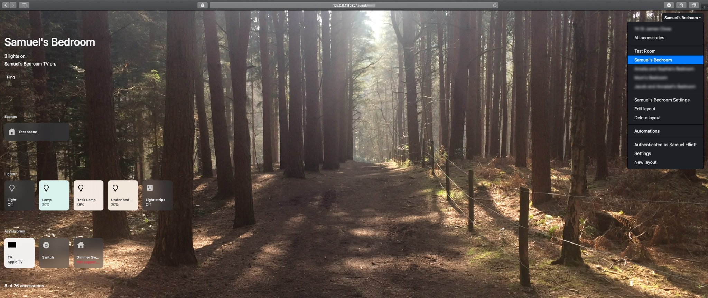

HomeKit Accessory Server
===

Home automation system based on HomeKit.

It includes a web interface for controlling accessories. Scenes, custom controls, configuring accessories in the web
interface, storing historical data and configuring automations in the web interface are not supported yet.

It includes a plugin system to add accessories, accessory configuration, authentication and options for automations.
All Homebridge plugins are supported.




### TODO

A lot.

- Web interface
    - [x] Layouts
        - Customisable by dragging sections and accessories in the web interface.
        - [x] Scenes
        - [x] [Custom sections with plugins](docs/plugins.md#accessoryuiregisterlayoutsectioncomponent)
        - [ ] Accessory groups (one tile controls multiple accessories)
    - [x] Basic accessory control (on/off)
        - [x] Switch
        - [x] Lightbulb
        - [x] Programmable Switch (shows last action for five seconds)
        - [x] Outlet
        - [x] Television
        - [x] Lock Mechanism
        - [x] Garage Door Opener
        - [ ] [All other services supported by hap-nodejs](https://github.com/khaost/hap-nodejs/tree/master/lib/gen)
        - [x] [Other services with plugins](docs/plugins.md#accessoryuiregisterservicecomponent)
    - [x] Accessory control
        - [x] Switch
        - [x] Lightbulb
        - [ ] Programmable Switch
        - [x] Outlet
        - [ ] Television
            - [x] Input selection
            - [ ] Remote
        - [ ] Lock Mechanism
        - [ ] Garage Door Opener
        - [ ] [All other services supported by hap-nodejs](https://github.com/khaost/hap-nodejs/tree/master/lib/gen)
        - [x] [Other services with plugins](docs/plugins.md#accessoryuiregisteraccessorydetailscomponent)
    - [ ] Accessory groups
    - [x] Dark theme [(system wide)](https://caniuse.com/#search=prefers-color-scheme)
    - [ ] Notifications
- [x] [Desktop app](https://gitlab.fancy.org.uk/hap-server/electron-app)
    - Electron app that wraps the web interface and provides notifications in the background.
    - Supports all operating systems supported by Electron (though for macOS you probably want to use the built in
        Home app).
    - Uses a local copy of the web interface instead of using the server's.
- [ ] Historical data
    - [ ] Store changes to an accessory's state
    - [ ] Elgato Eve???
- [ ] Security
    - [x] Web interface authentication
        - Completely handled by plugins.
    - [x] Permissions
        - [ ] Web interface permission checks
    - [ ] Per-user HomeKit bridges
        - This would allow you to configure all accessories in hap-server and then allow multiple people to create
            their own homes with read-only access (or no access) to other people's accessories instead of sharing a
            single home where everyone has permission to control all accessories. Also allows users to choose
            their own favourite accessories/scenes/colours and using multiple devices without an Apple ID.
- [x] Scenes
    - Works with automations. (Scenes just run automation conditions to check if they're enabled and automation
        actions to activate/deactivate them.)
    - [ ] Simple scene editor. (Set accessories to create active conditions and activate/deactivate actions.)
    - [ ] Restore state before scene was enabled (using existing historical data)
- [x] Automations
    - [x] Create automations that can run on the server
        - Useful if you don't have an Apple TV 4, HomePod or always home iPad.
        - Also could easily allow for more flexible automations than HomeKit allows.
    - [x] Manage automations in the web interface
        - TODO:
            - [ ] Better error handling
            - [x] Handle triggers/conditions/actions that don't have an editor component
            - [ ] Set characteristic action editor
    - [x] Triggers
        - [x] Cron expressions
        - [ ] Characteristic changes
            - [ ] Any change
            - [ ] Set to value
            - [ ] Set below/above value
    - [x] Conditions
        - [x] All/any
        - [x] JavaScript
        - [ ] Check characteristic
    - [x] Actions
        - [x] Conditional
        - [x] JavaScript
        - [x] Set characteristic
            - [x] Increment/decrement
            - [ ] Transitions
- [ ] Temporary scheduled actions
    - "Turn the lights off in 10 minutes."
- [ ] Configuration
    - [ ] Add + configure accessories in the web interface
        - [x] Set home/accessory/service names
    - [x] Server output
    - [x] Custom layouts
    - [ ] Manage users/permissions
    - [ ] Manage HomeKit bridges + choose accessories to expose
        - Per-user HomeKit bridges (see above)
    - [ ] Expose accessories via multiple bridges
    - [ ] Manage + name HomeKit pairings
- [ ] Camera accessories
- [x] Add HomeKit accessories
    - [x] HomeKit over IP
    - [ ] HomeKit over BLE
- [x] Plugins
    - [x] Accessories
    - [x] Accessory platforms
    - [x] All current Homebridge accessories + accessory platforms
    - [x] Web interface plugins
        - [x] Layout sections
        - [x] Basic accessory control
        - [x] Accessory control
        - [x] Accessory + accessory platform discovery + setup
            - Discovery + setup UI works but accessories aren't actually created yet.
        - [ ] Accessory + accessory platform configuration
        - [x] Authentication
        - [x] User management
        - [x] Automation trigger configuration
        - [x] Automation condition configuration
        - [x] Automation action configuration
    - [ ] Web interface themes?
    - [x] Automation plugins
        - Automation plugins can run other automation conditions/actions.
        - [x] Automation triggers
        - [x] Automation conditions
        - [x] Automation actions
    - [ ] Install + manage plugins in the web interface?
        - Like server output???
- Internal features
    - [x] Cached accessories
        - Accessory configuration can be cached so the server can run immediately and have accessories load in the
            background.
- [x] Full compatibility with Homebridge
    - Run instead of Homebridge and use all Homebridge plugins with the web interface. Homebridge accessories appear
        and can be controlled in the web interface, by automations on the server and with hap-server's HAP bridges.

Installation
---

```
npm install -g @hap-server/hap-server

# Or if that doesn't work
sudo npm install -g @hap-server/hap-server
```

This will install hap-server and link the `hap-server` executable.

You can now run hap-server with your configuration. Once you've tested your configuration you'll probably want to
set it up as a system service with `systemd` (Debian), `launchd` (macOS) or whatever service manager you have
installed.

hap-server requires a plugin to authenticate access to the web interface. You can use the
[authenticate-pam](https://gitlab.fancy.org.uk/hap-server/authenticate-pam) plugin to allow local users on the
server to access the web interface. If you don't install an authentication handler you won't be able to access the
web interface, but you'll still be able to configure hap-server using it's configuration file.

```
npm install -g @hap-server/authenticate-pam
```

By default users with the IDs `root` and `cli-token` (the user used when running CLI commands) are administrators.
When using the authenticate-pam plugin you'll need to assign your user an ID the first time you use it. (A proper
setup workflow will be added soon.) Once you have an account setup you can make your account an administrator.

```
hap-server make-admin {user-id}
# Or with the path to the configuration file
hap-server make-admin {user-id} --config data/config.yaml
```

Usage
---

To run hap-server, just run `hap-server`.

```
Samuels-MacBook-Air:~ samuel$ hap-server
[28/02/2019, 01:56:01] Starting hap-server with configuration file /Users/samuel/.homebridge/config.json
...
```

hap-server will exit with an error if the configuration file doesn't exist. To use a custom configuration file path
pass it as the first argument. hap-server allows you to write your configuration file in either JSON or YAML.

```
Samuels-MacBook-Air:hap-server samuel$ hap-server data/config.yaml
[28/02/2019, 01:56:01] Starting hap-server with configuration file /Users/samuel/Documents/Projects/hap-server/data/config.yaml
...
```

hap-server can automatically setup HTTPS with a self signed certificate and advertise the web interface with Bonjour.
To use this add the `--advertise-web-interface` flag.

```
Samuels-MacBook-Air:hap-server samuel$ hap-server data/config.yaml --advertise-web-interface
...
[27/07/2019, 01:00:03] You can access the web interface on your local network at https://hap-server-12b083b6-dd04-49a7-abac-171388e99db2.local:51820/,
[27/07/2019, 01:00:03]     (remember to install the TLS certificate at /Users/samuel/Documents/Projects/hap-server/data/certificates/12b083b6-dd04-49a7-abac-171388e99db2.pem,
[27/07/2019, 01:00:03]         fingerprint: c9:01:0c:f7:54:80:3d:b4:57:fd:33:27:c0:2f:f2:d2:de:b8:22:de:9a:ef:9e:56:ec:7f:c9:05:c9:72:34:a4)
...
```

All Homebridge command line flags work with hap-server.

```
Samuels-MacBook-Air:~ samuel$ hap-server help
hap-server [config]

Run the HAP and web server

Commands:
  hap-server [config]                       Run the HAP and web server [default]
  hap-server make-admin <user>              Promote a user to administrator
  hap-server get-characteristics <config>   Get characteristics
  <characteristics>
  hap-server set-characteristic <config>    Set a characteristic
  <characteristic> <value>
  hap-server version                        Show version number

Positionals:
  config  The configuration file to use
                     [string] [default: "/Users/samuel/.homebridge/config.json"]

Options:
  --debug, -D                     Enable debug level logging
                                                      [boolean] [default: false]
  --timestamps, -T                Add timestamps to logs
                                                       [boolean] [default: true]
  --force-colour, -C              Force colour in logs[boolean] [default: false]
  --help                          Show help                            [boolean]
  --advertise-web-interface       Automatically setup a HTTP server with a self
                                  signed TLS certificate for the web interface
                                  and advertise it through Bonjour
                                                      [boolean] [default: false]
  --advertise-web-interface-port  Port to listen on for the automatically
                                  advertised web interface
                                                       [number] [default: 51820]
  --data-path, -U                 Path to store data                    [string]
  --plugin-path, -P               Additional paths to look for plugins at as
                                  well as the default location ([path] can also
                                  point to a single plugin)              [array]
  --print-setup, -Q               Print setup information
                                                      [boolean] [default: false]
  --allow-unauthenticated, -I     Allow unauthenticated requests (for easier
                                  hacking)            [boolean] [default: false]
  --user, -u                      User to run as after starting
  --group, -g                     Group to run as after starting
```

To show the version number run `hap-server version`.

```
Samuels-MacBook-Air:~ samuel$ hap-server version
hap-server version 0.7.2 production
homebridge version 0.4.50, API 2.4
hap-nodejs version 0.4.51
```

Configuration
---

hap-server stores data in the same default location as Homebridge and supports the same configuration. Using the same
configuration as Homebridge, hap-server will behave exactly like Homebridge but will have a web interface for
controlling accessories. Using Homebridge and hap-server plugins at the same time are supported, however you shouldn't
run multiple instances of hap-server/Homebridge using the same data location.

[See docs/config.md.](docs/config.md)

You can also use hap-server programmatically with `Server.createServer`.

```js
import {Server} from 'hap-server';

const server = await Server.createServer({
    config: ...,
    data_path: ...,
});

// See src/cli.js to see what you can do with the Server object
```

Development
---

```
# Clone the git repository
git clone https://gitlab.fancy.org.uk/hap-server/hap-server.git
cd hap-server

# Install dependencies
npm install

# Build/watch the backend and example plugins
npx gulp watch-backend watch-example-plugins &

# Copy the example configuration
mkdir -p data
cp example-config/config.yaml data

# Run the server (this will build the frontend)
bin/hap-server data/config.yaml
```

To build the frontend in Gulp instead of the hap-server process (and disable webpack hot module replacement) add
`watch-frontend` to the Gulp command and add the `--no-webpack-hot` to the hap-server command.

To use the [standalone Vue devtools](https://github.com/vuejs/vue-devtools/blob/master/shells/electron/README.md)
run `npx vue-devtools` and pass the `--vue-devtools-port` flag to `hap-server`.

```
npx vue-devtools &

bin/hap-server data/config.yaml --vue-devtools-port 8098
# Also pass --vue-devtools-host if you want to use the Vue devtools to work on other devices
bin/hap-server data/config.yaml --vue-devtools-host samuels-macbook-air.local --vue-devtools-port 8098
```

Plugins
---

hap-server supports all Homebridge plugins, but also has it's own plugin API that allows plugins to use hap-server
features.

[See docs/plugins.md.](docs/plugins.md)

Credits + License
---

hap-server is built on [Apple HomeKit/HAP](https://apple.com/uk/homekit/),
[HAP-NodeJS](https://github.com/KhaosT/HAP-NodeJS) and [Homebridge](https://github.com/nfarina/homebridge).

hap-server is released under [the MIT license](LICENSE).

If you'd like to contribute to hap-server please
[create an account on my GitLab server](https://gitlab.fancy.org.uk/hap-server) and
[contact me](https://samuelthomas2774.github.io/#contact) ([Tor](http://selliottuzpeu4ry.onion/#contact)).
